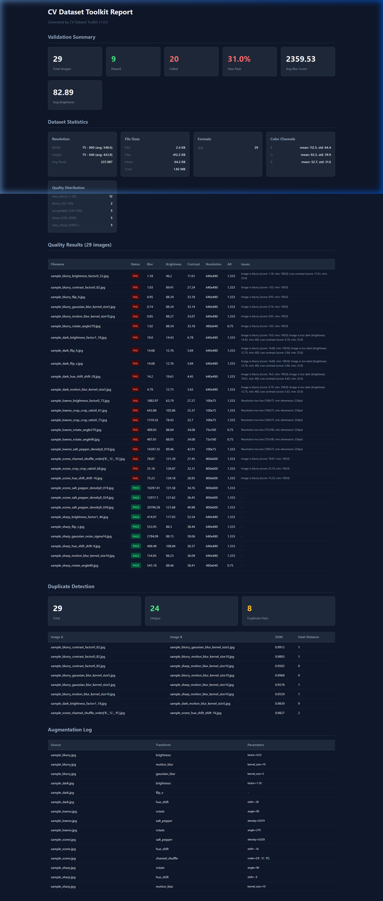

# CV Dataset Toolkit

A Python + OpenCV pipeline for **automated image data augmentation**, **quality validation**, **duplicate detection**, and **dataset statistics** — designed for preparing and quality-checking datasets for AI/Computer Vision model training.



## Features

### 🔄 Data Augmentation (16 Transforms)
- **Geometric**: Rotation (90, 180, 270), horizontal/vertical flip, random cropping, perspective warping, elastic deformation.
- **Color / Intensity**: Brightness, contrast, CLAHE (local contrast enhancement), hue shift, color channel shuffle.
- **Noise / Blur**: Gaussian noise, salt-and-pepper noise, Gaussian blur, motion blur, cutout (occlusion rectangles).
- **Seed-based reproducibility**: Reproducible runs for pipeline consistency.

### ✅ Quality Validation (8 Checks)
- **Sharpness**: Laplacian variance scoring to catch out-of-focus/blurry images.
- **Brightness**: Mean luminance checking to detect under-exposed (dark) and over-exposed (bright) images.
- **Contrast**: Standard deviation validation of pixel intensities to flag flat/washed-out images.
- **Resolution**: Minimum dimension enforcement to ensure images meet minimum network input size.
- **Aspect Ratio**: Width-to-height ratio checking to filter out extreme shapes.
- **Noise Level**: Median filter delta estimation to catch high-noise inputs.
- **Saturation**: Mean saturation evaluation to detect grayscale or near-grayscale images.
- **Corruption**: Structural file decode verification to filter out corrupt/incomplete files.

### 👥 Duplicate Detection
- **Perceptual Hashing**: Fast horizontal dHash computation to pre-screen duplicates.
- **SSIM Verification**: Structural Similarity Index (Wang et al. 2004) to confirm actual duplicates, eliminating hash-collision false positives for solid/flat colors.

### 📊 Dataset Statistics & Reporting
- Comprehensive dataset metrics: file sizes, dimensions, formats, color intensities, and quality bucket distributions.
- Self-contained **HTML Dashboard Report** with interactive summaries, tables, and color-coded status badges.

---

## Installation

Ensure you have Python 3.8+ installed, then install dependencies:

```bash
pip install -r requirements.txt
```

---

## Usage

### 1. Run the Full Pipeline (Augment + Validate + Stats + Duplicates + HTML Report)
Run the entire dataset pipeline with one command:
```bash
python main.py pipeline --input ./sample_images --output ./output --count 3 --seed 42
```

### 2. Augment Images Only
Apply random augmentations from the 16 available transforms:
```bash
python main.py augment --input ./sample_images --output ./output/augmented --count 5
```

### 3. Quality Validation Only
Validate all images against threshold configurations:
```bash
python main.py validate --input ./sample_images --output ./output/reports --blur-threshold 100 --min-resolution 224
```

### 4. Duplicate Finder Only
Detect and suggest removal candidates for duplicate pairs:
```bash
python main.py compare --input ./sample_images --output ./output/reports --ssim-threshold 0.95
```

### 5. Compute Statistics Only
Analyze dataset metrics (resolutions, channels, file size distribution):
```bash
python main.py stats --input ./sample_images --output ./output/reports
```

### 6. Generate HTML Report from Existing Data
Re-generate the HTML Dashboard from existing JSON report files:
```bash
python main.py report --output ./output
```

---

## Output Structure

```
output/
├── augmented/          # Generated augmented image variants
│   ├── image1_rotate_angle90.jpg
│   ├── image1_cutout_num_rects2.jpg
│   └── ...
├── metadata/           # Augmentation log entries for reproducibility
│   └── augmentation_log.json
└── reports/            # Quality, duplicate, and statistics reports
    ├── quality_report.json
    ├── quality_report.csv
    ├── duplicate_report.json
    ├── dataset_stats.json
    └── report.html     # Interactive HTML Dashboard
```

---

## Running Tests

The toolkit includes a comprehensive suite of 60 unit tests covering all augmentations, validation rules, and duplication checks.

Install test dependencies and run tests:
```bash
pip install pytest
python -m pytest tests/ -v
```

---

## Technical Stack

- **Python 3.8+**
- **OpenCV** — Custom image processing, resizing, filtering, and colorspace transformations.
- **NumPy** — Matrix/tensor computations for noise injection, pixel operations, and histograms.
- **SciPy** — Elastic deformation and smoothing filters.

## Author

Vikas Kumar — [GitHub](https://github.com/Vikaumar)
